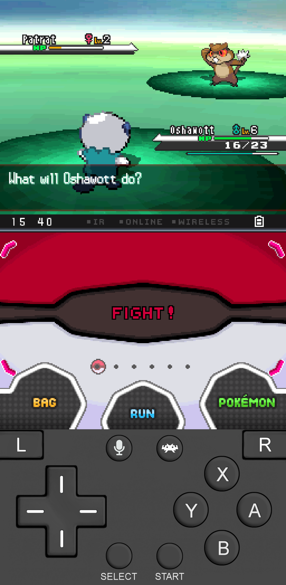
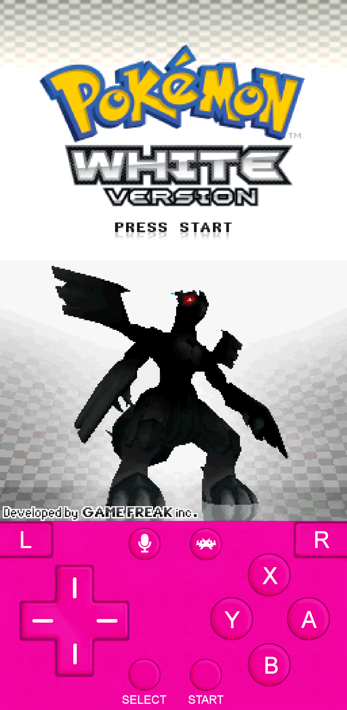

# Nintendo DS Overlay

An overlay for the Nintendo DS meant to be used in portrait mode on a touch screen device. 

There are several different color options, including blue, gray, green, orange, pink, purple, red, teal, and yellow! 
Below are two examples of how the gamepad overlay will look.

|Gray|Pink|
|:---:|:---:|
|  |  |

## Download
Click the button below to download this overlay. 

<kbd>   [Download](https://github.com/Oshanotter/test/releases/download/Release/nds.zip)   </kbd>